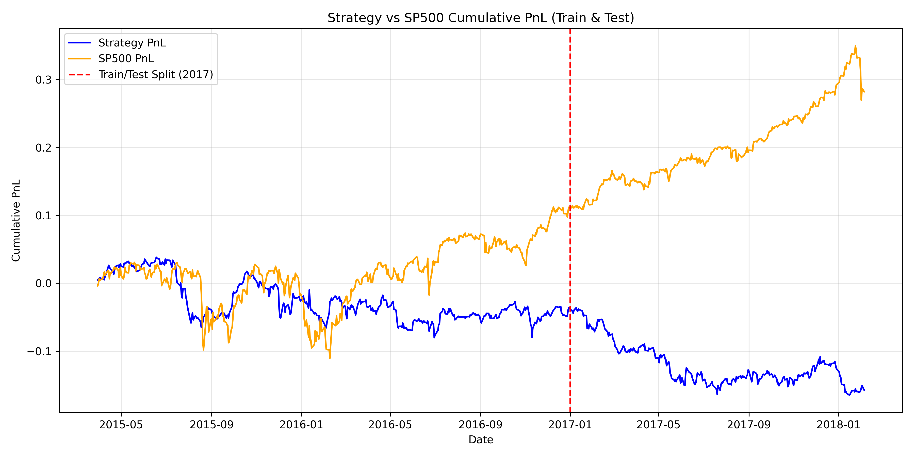

# Strategy Backtesting Report

## Methodology

### Features Used
- Bollinger Bands (Mvg Avg, High/Low Bands, relative Position)
- Relative Strength Index (RSI)
- Moving Average Convergence Divergence (MACD, Signal, Diff)

### Machine Learning Pipeline
- **Imputer**: SimpleImputer (median strategy)
- **Scaler**: StandardScaler
- **Classifier**: RandomForestClassifier

### Cross-Validation
- **Method**: Blocking Time Series Split (Sliding Window without overlap)
- **Folds**: 10
- **Train Length**: Minimum 2 years of history.

### Strategy Chosen
- **Description**: Stock picking (Long K best, Short K worst) based on highest and lowest output signal probabilities. K=10.
- **Investment**: Invests $1 total per day, equally weighted across the 2K positions ($0.05 per position).
- Leverages Out-of-Fold (OOF) daily predictions. The PnL calculation maps day D's signal with the actual return achieved between D+1 and D+2 to avoid forward-looking data leakage.

## Results
- **Final Strategy Cumulative PnL**: -0.0363
- **Final SP500 Cumulative PnL**: 0.1118
- **Strategy Max Drawdown**: -11.72%
- **SP500 Max Drawdown**: -14.16%

